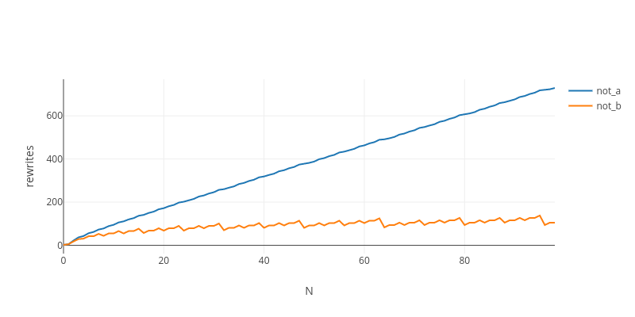
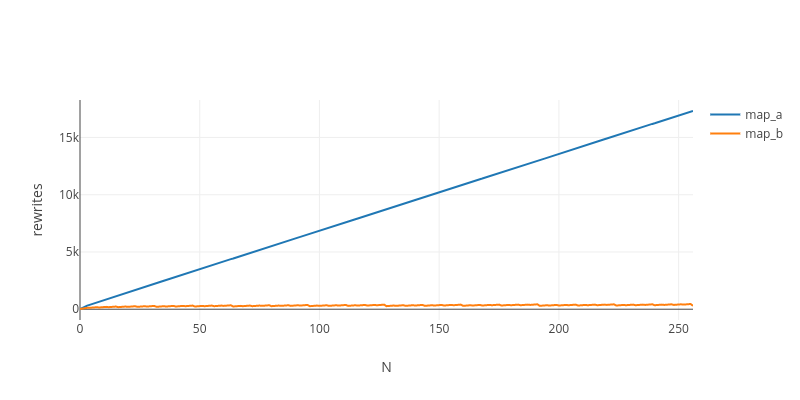

<!-- [Docusaurus blogging features](https://docusaurus.io/docs/blog) are powered by the [blog plugin](https://docusaurus.io/docs/api/plugins/@docusaurus/plugin-content-blog).

Simply add Markdown files (or folders) to the `blog` directory.

Regular blog authors can be added to `authors.yml`.

The blog post date can be extracted from filenames, such as:

- `2019-05-30-welcome.md`
- `2019-05-30-welcome/index.md`

A blog post folder can be convenient to co-locate blog post images:


The blog supports tags as well!

**And if you don't want a blog**: just delete this directory, and use `blog: false` in your Docusaurus config. -->

Yesterday, I reported the bizarre observation that certain functions can behave as if they had negative complexity. If you haven’t checked that article yet, it isn’t necessary, but you should, as it may blow your mind. In short, the λ-term f(bits) = copy(comp(inc,n,bits)), when given to optimal λ-calculus evaluator, is asymptotically faster than g(bits) = comp(inc,n,bits); i.e.,copy (a O(1) operation for a fixed size) behaves as if it had a O(1/n) complexity, causing the program to run faster by doing more things (!?).

That’s not the only bizarre complexity result I had when experimenting with the Abstract Algorithm. Years ago, I noticed that it is capable of computing programs that wouldn’t fit in a computer the size of the universe. Recently, I posted how it [can apply a O(1) operation N times in [O(log(N)) time](https://github.com/VictorTaelin/articles/tree/master/0004-supercompilation-for-free) (!?). Despite insightful answers being provided, it was hard to make sense of such unintuitive behaviors.

After a lot of research and some recent insights, it finally hit me. Turns out the explanation for all of that is pretty simple, and, in this article, I’ll explain what is going on carefully (not jokingly this time). If you’re in a hurry, feel free to skip to the tl;dr at the end.

1. Optimizable functions are those that fuse when self-composed
First, let’s start with the simplest example on which something interesting happens: repeated not. Let’s implement it in two different ways:

```haskell
True  = λt. λf. t  
False = λt. λf. f  
not\_a = λb. (b False True)  
not\_b = λb. λt. λf. (b f t)
```

If you don’t understand those definitions, you can read about lambda encodings, but that’s not too important. Now, how would consecutive applications of not_a and not_b perform in Absal (an implementation of the Abstract Algorithm)? Here is a chart:



Complexity (total rewrites) of applying “not” N times to True

Here, complexity is measured as graph rewrites. Don’t worry about that, though, just assume the time it takes to run a λ-term is proportional to the number of graph rewrites. As you can see, not_a performs linearly, while not_b performs logarithmically. That’s a huge difference, for such a small change! And is also very unintuitive, because you shouldn’t be able to apply N nots in O(log(N)). Then why that happens? Before answering, let’s first make an experiment. Let’s compose both functions with themselves and check their normal forms.

norm(not_a.not_a): λb. (b (λt.λf.f) (λt.λf.t) (λt.λf.f) (λt.λf.t))
norm(not_b.not_b): λb. λt. λf. (b t f)
Interesting: once self-composed, not_a grows larger, but not_b stays the same size. Why? Because the later function fused. That’s the same effect that allows Haskell to turn several passes over a list in a single pass, eliminating intermediate structures. This leads us to hypothesize that the magical speedup could have something to do with that property. Let’s check that hypothesis by testing the map operation on lists:

Nil   =         λc. λn. n  
Cons  = λh. λt. λc. λn. c h (t c n)  
map\_a = λf. λl.         l (λh. λt. Cons (f h) t) Nil  
map\_b = λf. λl. λc. λn. l (λh. λt. c    (f h) t) n  
list  = Cons True (Cons False (Cons True (Cons False Nil)))
Here, we once again defined it in two different ways: map_b fuses and map_a doesn’t. Let’s measure the complexity of applying map repeatedly to a list:



Complexity (total rewrites) of applying “map” N times to a list of 4 elements

As you can see, the same behavior is observed here: the version that fuses performs logarithmically, while the version that doesn’t performs linearly, supporting our hypothesis. Woa! But why would that happen?

(Here is the code for reproducing that experiment and generate the charts.)

2. Exponentiation by squaring = composition by sharing

To understand that, let’s first talk about integer exponentiation. If you’re a developer, chances are you’ve heard about exponentiation by squaring. It is an ancient, simple algorithm capable of computing A^B in much less steps than it’d take to multiply A repeatedly, B times. To refresh our minds, let’s visualize how it works:

```sh
\# Computing 13^8 with repeated multiplication13^2 = 13 \* 13 = 169  
13^3 = 13 \* 169 = 2197  
13^4 = 13 \* 2197 = 28561  
13^5 = 13 \* 28561 = 371293  
13^6 = 13 \* 371293 = 4826809  
13^7 = 13 \* 4826809 = 62748517  
13^8 = 13 \* 62748517 = 815730721\# Computing 13^8 with exponentiation by squaring13^2 = 13 \* 13 = 169  
13^4 = 169 \* 169 = 28561  
13^8 = 28561 \* 28561 = 815730721
```

As you can see, the first approach multiplies 13 one-by-one, needing N multiplications to reach 13^N (linear time), while the second repeatedly squares the first number instead, allowing it to jump from 13^1 to 13^2 to 13^4 to 13^8 in a single multiplication for each jump (logarithmic time). To compute values that aren’t perfect squares, you just multiply sub-terms, i.e., 13^11 = 13^8 * 13^2 * 13^1.

Neat, right? But how is that relevant? Due to a less known fact, for any function that can be fused by composition, we can also compute its repeated application in O(log(N)) steps using that same trick! Let’s visualize it too:

```sh
\# Computing not^8(t) with repeated applicationnot^2(t) = (λb.λf.λt. b f t) . (λb.λf.λt. b f t) = (λb.λf.λt. b t f)  
not^3(t) = (λb.λf.λt. b f t) . (λb.λf.λt. b t f) = (λb.λf.λt. b f t)  
not^4(t) = (λb.λf.λt. b f t) . (λb.λf.λt. b f t) = (λb.λf.λt. b t f)  
not^5(t) = (λb.λf.λt. b f t) . (λb.λf.λt. b t f) = (λb.λf.λt. b f t)  
not^6(t) = (λb.λf.λt. b f t) . (λb.λf.λt. b f t) = (λb.λf.λt. b t f)  
not^7(t) = (λb.λf.λt. b f t) . (λb.λf.λt. b t f) = (λb.λf.λt. b f t)  
not^8(t) = (λb.λf.λt. b f t) . (λb.λf.λt. b f t) = (λb.λf.λt. b t f)\# Computing not^8(t) with composition by sharingnot^2(t) = (λb.λf.λt. b f t) . (λb.λf.λt. b f t) = (λb.λf.λt. b t f)  
not^4(t) = (λb.λf.λt. b t f) . (λb.λf.λt. b t f) = (λb.λf.λt. b t f)  
not^8(t) = (λb.λf.λt. b t f) . (λb.λf.λt. b t f) = (λb.λf.λt. b t f)
```

Ok, that is way too hard to read. Let’s replace lambdas by their names:

```sh
\# Computing not^8(x) with repeated applicationnot^2(x) = not . not = id   
not^3(x) = not . id  = not  
not^4(x) = not . not = id   
not^5(x) = not . id  = not  
not^6(x) = not . not = id   
not^7(x) = not . id  = not  
not^8(x) = not . not = id\# Computing not^8(x) with composition by sharingnot^2(x) = not . not = id   
not^4(x) = id  . id  = id   
not^8(x) = id  . id  = id
```

Can you see it? The first approach applies nots one by one, needing N applications to reach the final result (linear time), while the second repeatedly self-composes the initial function, jumping from not^2 to not^4 to not^8 with just a single composition for each jump (logarithmic time). In other words, as long as the self-composition of **f** fuses, we can implement repeated application in logarithmic time, using the same trick behind exponentiation by squaring!

